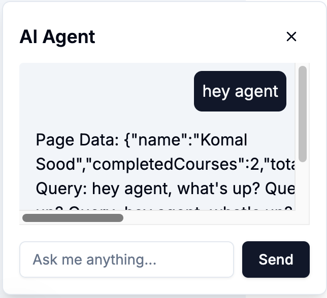

# Capstone Project Documentation: Educational Module Platform

## Table of Contents
- [Introduction](#introduction)
- [Features](#features)
- [Technologies Used](#technologies-used)
- [Installation](#installation)
- [Environment Variables](#environment-variables)
- [Data Structures](#data-structures)
- [API Endpoints](#api-endpoints)
- [Contributing](#contributing)
- [Setup Instructions](#setup-instructions)
- [Web App Demonstation](#web-app-demonstration)

## Introduction
This project is a web application designed as an educational module platform. It provides a structured way to organize and present learning content across different subjects. Users can browse subjects and access individual modules within those subjects.

## Features
- **Subject Browsing**: Users can browse available subjects (e.g., IoT, Blockchain, Machine Learning, Cloud Computing).
- **Module Access**: Each subject contains multiple modules with specific learning content.
- **Content Presentation**: Modules present learning content in a clear and organized manner.
- **Data Management**: The platform efficiently manages and stores subject and module data.
- (Add any other specific features, e.g., search, user progress tracking, quizzes, admin panel, etc.)

## Technologies Used
- **Frontend**: React, Next.js, HTML, CSS, JavaScript
- **Backend**: Python, Flask
- **Database**: (Specify the database used, if any, e.g., PostgreSQL, MongoDB, etc.)
- **Other**: Hugging Face Transformers, Flask-CORS

## Installation
1. Clone the repository:
    ```bash
    git clone https://github.com/Komallsood/capstone-project.git
    ```
2. Install the required dependencies:
    ```bash
    npm i
    uv pip install -r requirements.txt
    ```
3. Set up the environment variables (see below).
4. Run the application:
    ```bash
    npm run dev
    python ai_model_server.py
    ```

## Environment Variables
- `PORT`: The port number for the application (default: 3000)

## Data Structures
- **Subjects**: Each subject has an `id` (e.g., "iot"), a `name` (e.g., "Internet of Things").
- **Modules**: Each module belongs to a subject and has an `id` (e.g., "iot-basics"), a `title` (e.g., "IoT Fundamentals"), and `content` (the learning material).


## API Endpoints (Tentative)
- `GET /api/login`: Returns a list of all subjects.
- `GET /api/subjects/:id/modules`: Returns a list of modules for a specific subject.
- `GET /api/modules/:id`: Returns the content for a specific module.
- (Add descriptions for all other endpoints, including request parameters, response format, etc.)

## Contributing
Contributions are welcome! If you would like to contribute to this project, please follow these guidelines:
1. Fork the repository.
2. Create a new branch for your changes.
3. Make your changes and commit them.
4. Push your changes to your fork.
5. Open a pull request with a clear description of the changes.

## Setup Instructions
1. **Create and Activate a Virtual Environment**
    ```bash
    python -m venv venv
    source venv/bin/activate
    ```
2. **Install Required Python Packages**
    See the `requirements.txt` file available with the following content:
    ```plaintext
    Flask
    Flask-CORS
    transformers
    ```
    Install the dependencies:
    ```bash
    pip install -r requirements.txt
    ```
3. **Download and Save the GPT-2 Model Locally**
    Create a script named `download_model.py`:
    ```python
    from transformers import GPT2LMHeadModel, GPT2Tokenizer

    model_name = "gpt2"
    model = GPT2LMHeadModel.from_pretrained(model_name)
    tokenizer = GPT2Tokenizer.from_pretrained(model_name)

    model.save_pretrained("./model")
    tokenizer.save_pretrained("./model")
    ```
    Run the script to download the model:
    ```bash
    python download_model.py
    ```
    

4. **Set Up the Flask Server**
    Create a script named `ai_model_server.py`:
    ```python
    from flask import Flask, request, jsonify
    from transformers import GPT2LMHeadModel, GPT2Tokenizer

    app = Flask(__name__)
    model = GPT2LMHeadModel.from_pretrained("./model")
    tokenizer = GPT2Tokenizer.from_pretrained("./model")

    @app.route('/generate', methods=['POST'])
    def generate():
        input_text = request.json.get('input_text')
        inputs = tokenizer.encode(input_text, return_tensors='pt')
        outputs = model.generate(inputs, max_length=50)
        generated_text = tokenizer.decode(outputs[0], skip_special_tokens=True)
        return jsonify({'generated_text': generated_text})

    if __name__ == '__main__':
        app.run(port=5000)
    ```
    Run the Flask server:
    ```bash
    python ai_model_server.py
    ```
    

5. **Run the React Application**
    Ensure the React application is correctly configured to interact with the Flask server. Start the React application:
    ```bash
    npm start
    ```
    


### Web App Demonstration

#### Login Page


#### Student Login


#### Module Dashboard


#### Enrolled Subjects Panel


#### Troubleshoot chat window


### AI Agent query window

